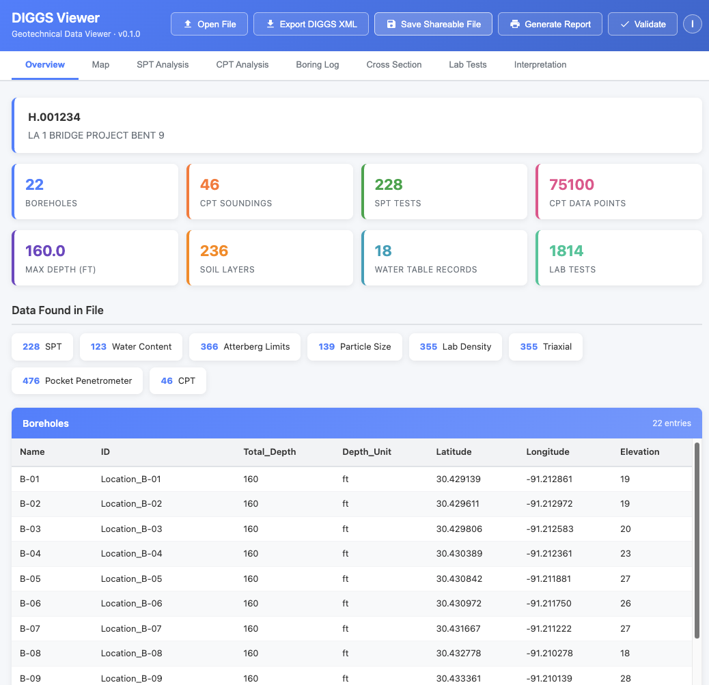

# The DIGGS Wrapper: Giving Your Geotechnical Data a Face Only a Human Could Love

*Ripon Chandra Malo & DIGGS Technical Committee*

---

## The Problem: Your Data Is Brilliant, But Nobody Can Read It

Let's be honest. DIGGS files are not exactly beach reading.

Since its inception, DIGGS (Data Interchange for Geotechnical and Geoenvironmental Specialists) has excelled at what it was designed to do: give software a clean, standardized, machine-readable format for exchanging geotechnical data. Boring logs, CPT soundings, lab results, spatial coordinates — it's all in there, rigorously structured and ready for any compliant application to consume.

And that's the thing. *Software* loves DIGGS. Parsers love DIGGS. Databases love DIGGS. But when you open a DIGGS file and see a wall of angle brackets and namespace declarations? Not exactly the boring log you were hoping to review before your 2 o'clock meeting.

> **The Core Tension**
>
> DIGGS was built to be machine-readable — and it's great at that job. But data doesn't just move between machines. It moves between *people*. Engineers review it. Clients ask about it. Regulators need to see it. The format that makes DIGGS powerful for interoperability is the same thing that makes it opaque to the human eye.

We've heard this feedback loud and clear. So the DIGGS team asked a simple question: **what if we could make DIGGS data just as easy to read for humans as it is for machines — without changing a single byte of the original file?**

## How It Started: From Student Hackathon to Production Tool

The answer didn't come from a corporate lab or a consulting firm. It came from a student who saw the problem and built a solution in nine weeks.

In early 2026, the Geo-Institute's DIGGS project launched the [2026 DIGGS Student Hackathon](https://github.com/DIGGSml/2026-DIGGS-Student-Hackathon) — a nine-week challenge running from January through March that invited students to build innovative tools using the DIGGS standard. Teams could tackle any of five challenge themes, from data conversion and validation to visualization and cross-discipline integration. The hackathon provided sample DIGGS files, weekly office hours, and access to datasets through Geosetta.org to help teams hit the ground running.

The **Ground Decoder** team from the **University of Utah** — led by **Ripon Chandra Malo**, with advisors **Dr. Tong Qiu** and **Dr. Kami Mohammadi** — took on the Visualization theme and built **DIGGS Analyzer**: a tool that could parse a DIGGS XML file and render its contents as interactive boring logs, charts, maps, and tables, all running entirely in a web browser. No server. No installation. Just open a file and see your data.

When the teams presented their work in Salt Lake City in March 2026, Ground Decoder's approach stood out. The judges recognized what every geotechnical engineer in the room was thinking: *this is exactly what DIGGS has been missing*. DIGGS Analyzer took home the winning prize.

The DIGGS Technical Committee saw the potential immediately. Working with Ripon and the Ground Decoder team, the hackathon prototype has been developed into the full-featured DIGGS Viewer — and the wrapping concept that packages it all into a single, shareable file. What started as a student project is now a production tool serving the entire geotechnical community.

## Introducing the DIGGS Wrapper

The DIGGS Wrapper takes your DIGGS XML file and wraps it inside a single, self-contained HTML file that works as an interactive data viewer. No software to install. No accounts to create. No server to connect to. No internet required.

**Double-click the file. It opens in your web browser. You're done.**

Your boring logs, CPT profiles, SPT charts, maps, lab data, and cross sections are right there in front of you — interactive, zoomable, and ready to review. No Python. No command line. No IT department. If you can double-click a file and you have a web browser, you can view DIGGS data.

## What You'll See When You Open It


*The DIGGS Viewer Overview tab: project metadata, data inventory at a glance, and a full borehole table — all from a single double-click.*

As you can see, the viewer opens to an Overview tab with your project metadata, a data inventory showing exactly what's in the file, and a full borehole table. Across the top, tabs give you direct access to your SPT and CPT analysis, boring logs, cross sections, lab tests, and more. The viewer intelligently shows only the tabs relevant to your data — no clutter, no empty screens.

Everything is interactive: hover over a data point to see its value, zoom into a chart, click a borehole on the map to jump to its details. The viewer automatically detects measurement units from your data — feet or meters, tsf or kPa — and displays them correctly throughout.

## Try It Yourself

### View Your Own DIGGS File

If you have a DIGGS XML file and just want to look at it, this is your fastest path:

1. **Download the DIGGS Viewer** HTML file from GitHub: [Download DIGGS Viewer](https://raw.githubusercontent.com/DIGGSml/diggs-viewer/main/viewer.html)
2. **Double-click** the downloaded file to open it in your browser.
3. Use the **file open button** to browse to your DIGGS XML file — or simply **drag and drop** it onto the page.
4. Your data appears instantly. Explore the tabs, review your boring logs, check your CPT profiles.

That's it. The viewer file is reusable — keep it on your desktop and open it any time you have a new DIGGS file to review.

### Share a Wrapped File

Sometimes you don't just want to *view* a DIGGS file — you want to *package* it so that anyone who receives the file can see the data immediately, without needing to download a separate viewer. You can do this right from the viewer itself: load your DIGGS file into the viewer, then **save the HTML page**. The saved file now contains your data baked inside — send it to a colleague and they just double-click to see everything.

For automated workflows, developers can also create wrapped files programmatically using the [Geosetta DIGGS Wrapper API](https://geosetta.org/api_docs/#diggs-viewer). (More details in the *For Developers* section below.)

### See It in Action with Real Data

Want to see a wrapped DIGGS file before you try it with your own data? We've included an [example wrapped file](https://github.com/DIGGSml/diggs-viewer/blob/main/example.html) right in the diggs-viewer repository — download it, double-click it, and explore a real DIGGS dataset in your browser.

For even more data, [Geosetta.org](https://geosetta.org) is now serving all of its historic geotechnical exploration data as wrapped DIGGS files. Head to the Geosetta web map, browse to a location, and download a wrapped file for any available borehole or exploration point. Double-click the file and you'll see boring logs, test data, and all — right in your browser.

## Your DIGGS File Is Still Your DIGGS File

This is the part worth emphasizing: **the wrapper does not modify your DIGGS file.** Your original XML data is embedded inside the HTML wrapper completely intact and untouched. The wrapper adds a presentation layer on top of your data. It doesn't replace it, compete with it, or alter it in any way.

> **Think of it this way:** Imagine mailing a document. The envelope doesn't change the letter inside — it just makes it deliverable to the right person in a protected package. The DIGGS Wrapper works the same way: it's the envelope that lets your data travel to *human* audiences while keeping the original content perfectly preserved inside.

Need the original back? The viewer includes a built-in **XML Export** button that saves the embedded DIGGS data back to a standalone XML file. What you get out is identical to what you put in. For those working with software systems, the original DIGGS XML can also be extracted programmatically — it's embedded in a well-defined location within the HTML file.

> **Note:** The round-trip is lossless. Wrap a file, send it across the country, have someone view it in their browser, extract the XML — and you've got the exact same DIGGS file you started with. The wrapper adds *presentation*, not transformation.

## Why This Matters for Your Practice

If you've been on the fence about DIGGS, the wrapper removes one of the most common objections: *"I can't see what's in the file."* Now you can. And so can everyone you share it with.

Consider these scenarios:

- **Sending data to a client**: Instead of shipping a DIGGS XML file that requires specialized software, send a wrapped file. They double-click it, see boring logs and CPT profiles in their browser, and your data speaks for itself.
- **QA/QC review**: Open a wrapped file to quickly spot-check that the DIGGS conversion captured your data correctly. See the boring logs, verify depths and blow counts, confirm locations on the map.
- **Archiving**: Store wrapped files alongside your raw DIGGS data. Years from now, anyone can open them without needing to track down compatible software — a web browser is all it takes.
- **Regulatory submittals**: Some agencies are beginning to accept or require digital data. A wrapped DIGGS file gives them both the standardized data *and* a human-readable view in one package.

## For Developers: The Geosetta Wrapper API

If you build software that produces or processes DIGGS files, the [Geosetta DIGGS Wrapper API](https://geosetta.org/api_docs/#diggs-viewer) lets you integrate wrapping directly into your workflow. It's a single endpoint:

```
POST https://geosetta.org/api/viewer/wrap

Content-Type: multipart/form-data
Body: DIGGS XML file (up to 50 MB, UTF-8)

Response: {filename}_viewer.html (self-contained, works offline)
```

No authentication required. Send a DIGGS file, get back a wrapped HTML viewer. The returned file includes all JavaScript, CSS, and visualization libraries bundled inside — your users won't need an internet connection to view it.

For those who want full control, the [diggs-viewer repository](https://github.com/DIGGSml/diggs-viewer) on GitHub is open source. You can build viewers locally using the included Python build script, customize the viewer for your needs, or integrate the source directly into your own tools.

## What's Next

The current viewer already covers many of the most common geotechnical data types, but we're just getting started. The DIGGS team is actively working to expand the viewer with support for additional data formats and test types within the DIGGS standard. The goal is straightforward: **if your data can be encoded in DIGGS, you should be able to *see* it in the viewer.**

Future enhancements will include additional in-situ test visualizations, expanded laboratory test reporting, instrumentation and monitoring data displays, and more geotechnical calculation tools. The viewer is open source, and we welcome contributions — if there's a data type or visualization you need, open an issue or submit a pull request on the [GitHub repository](https://github.com/DIGGSml/diggs-viewer).

## Get Involved

- **GitHub**: [https://github.com/DIGGSml](https://github.com/DIGGSml)
- **Monthly Meetings**: Contact Allen Cadden (acadden@schnabel-eng.com) or Ross Cutts (rcutts@schnabel-eng.com) for meeting invites.
- **Feedback**: Tell us what visualizations and data types matter most to you.

## Conclusion

For years, DIGGS has been the language that machines use to talk about geotechnical data. With the DIGGS Wrapper, we're making sure humans are part of the conversation too.

Your DIGGS file doesn't change. It doesn't get converted, simplified, or dumbed down. It gets *wrapped* — given a presentation layer that lets anyone with a web browser see what's inside. And when software needs the raw data, it peels off the wrapper and finds the original file waiting, exactly as it was.

Machine-readable *and* human-readable. That's not a compromise — it's the best of both worlds.

---

*Published by ASCE Geo-Institute | DIGGS Technical Committee*
